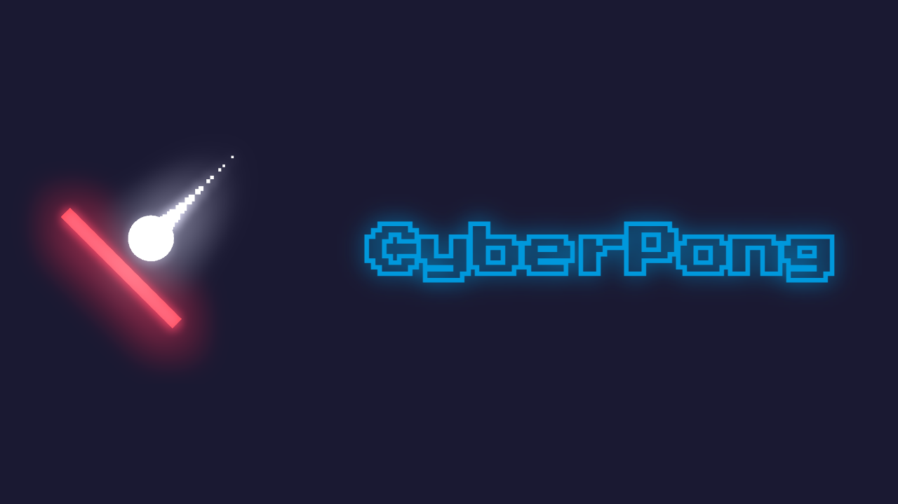

# CyberPong

 

CyberPong is an open source game made in Godot Engine 3, based on pong and adding a lot of neon effects with extra additions to make the game more fun!

## Installation
To install just go to the [releases page](https://github.com/YaikaRace/cyberpong/releases) and download the .zip file, then unzip it wherever you want and make sure that the .pck file is in the same folder as the executable file.

## Contributing

Pull requests are welcome. For major changes, please open an issue first
to discuss what you would like to change.

Please make sure to update tests as appropriate.

## License

Released under [GPL-3.0](/LICENSE) by [@YaikaRace](https://github.com/YaikaRace).
